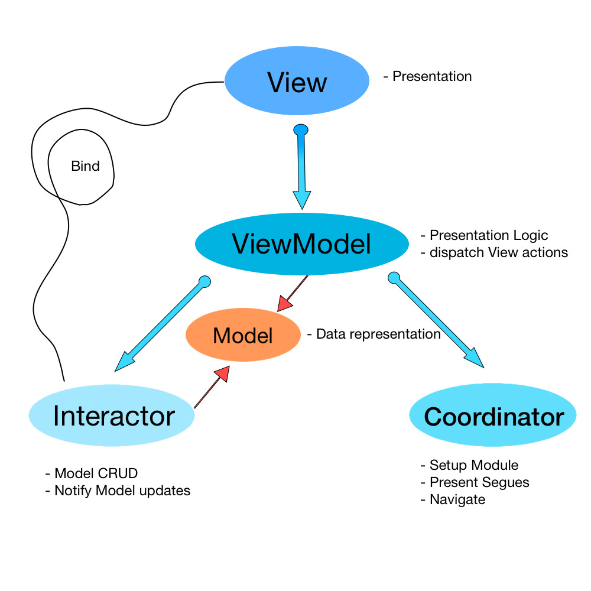

# Assignment
Assignment iOS app 

<h3>
Project structure follows MVVM-C pattern for better UI separation and faster load time
</h3>

MVVM pattern in general helps structure the API calls so that next time view appears, the app does not have to make extra API call to populate data

Some important files

1. NewsViewModel : [https://github.com/akshaykalucha3/Assignment/blob/master/Assignment/Assignment/App/Features/ViewModels/NewsViewModel.swift](https://github.com/akshaykalucha3/Assignment/blob/master/Assignment/Assignment/App/Features/ViewModels/NewsViewModel.swift)

2. GlobalViewModel : [https://github.com/akshaykalucha3/Assignment/blob/master/Assignment/Assignment/App/Features/ViewModels/GlobalViewModel.swift](https://github.com/akshaykalucha3/Assignment/blob/master/Assignment/Assignment/App/Features/ViewModels/GlobalViewModel.swift)

3. API Manager : [https://github.com/akshaykalucha3/Assignment/blob/master/Assignment/Assignment/APIManager/APIManager.swift](https://github.com/akshaykalucha3/Assignment/blob/master/Assignment/Assignment/APIManager/APIManager.swift)

4. API Constants : [https://github.com/akshaykalucha3/Assignment/blob/master/Assignment/Assignment/APIManager/APIConstant.swift](https://github.com/akshaykalucha3/Assignment/blob/master/Assignment/Assignment/APIManager/APIConstant.swift)

5. News Model : [https://github.com/akshaykalucha3/Assignment/blob/master/Assignment/Assignment/App/Features/Models/NewsModel.swift](https://github.com/akshaykalucha3/Assignment/blob/master/Assignment/Assignment/App/Features/Models/NewsModel.swift)

6. View Folder: [https://github.com/akshaykalucha3/Assignment/tree/master/Assignment/Assignment/App/Features/Views](https://github.com/akshaykalucha3/Assignment/tree/master/Assignment/Assignment/App/Features/Views)

1. clone repo into your local systems
2. install home brew
3. [install COCOAPODS](https://cocoapods.org/)
4. CD into project folder
5. if building on Mac Silicon Chips, 
    1. [https://armen-mkrtchian.medium.com/run-cocoapods-on-apple-silicon-and-macos-big-sur-developer-transition-kit-b62acffc1387](https://armen-mkrtchian.medium.com/run-cocoapods-on-apple-silicon-and-macos-big-sur-developer-transition-kit-b62acffc1387)
6. pod install 
7. Sign in to developers account - Apple ID 
8. Sign in to Gitlab
9. Build the Project using CMD+B
10. Run the App using CMD + R

1. How to change build from staging to prod
    1. Click on project product button     
    2. go to edit schemes
    3. change the config to staging for required build
2. How to run the app on local device
3. Send app for update or release
    1. Update Build and Version
    2. Select Build for any device
    3. Select Product > Archive
4. Different Bundle Identifier work not done.
